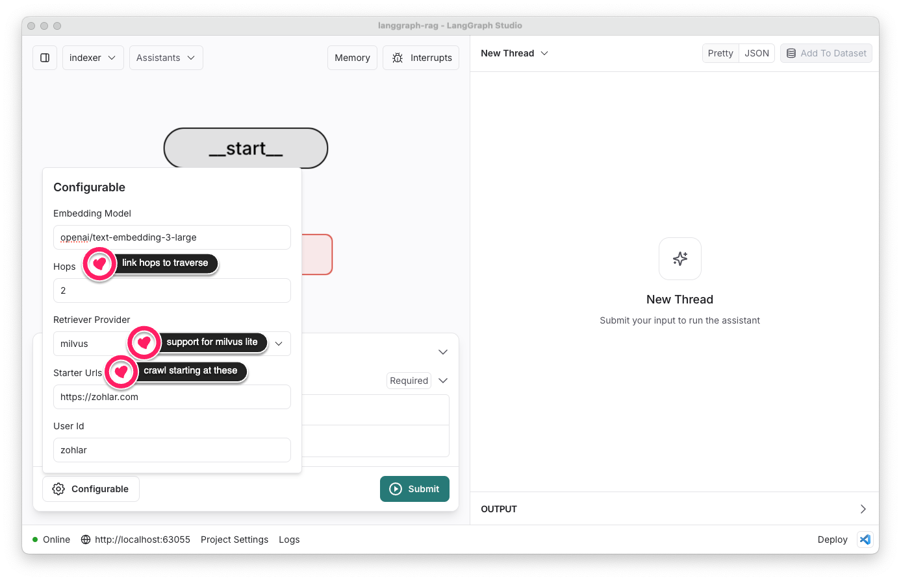
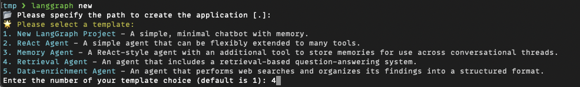
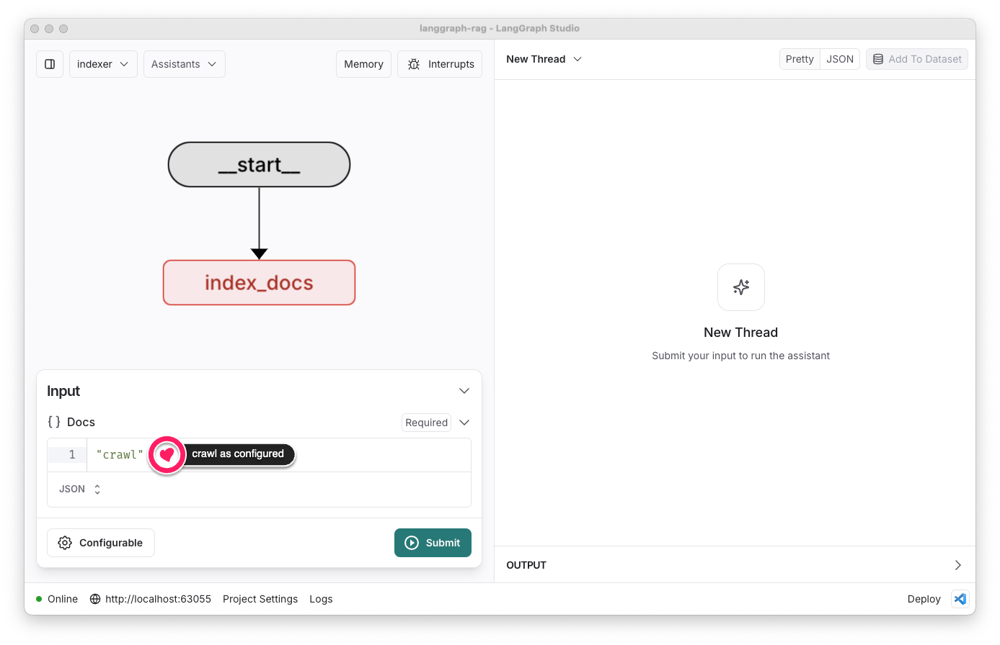

# Enhancements

## Motivation

As a developer I want to get a feel of what it is like to create an AI solution using langgraph for a well known usecase of QA based on website content.
I want to explore the following:

1. Jump start the solution (e.g., using ready solution templates)
2. Extending the solution
3. Debugging the solution
4. And finally deploying the solution in cloud

Langgraph had a ready template for Retrieval Augmented Generation (RAG) solutions. So I started with that and extended it for my specific requirements:
1. **Crawl** from **starter_urls** list within a certain number of **hops** to build vector index
2. Use open source vector DB - Milvus as a retriever

Here's a snapshot of how I modified the template solution.



## Process

### Create a new project using langGraph's retrieval agent template

Install the LangGraph CLI

```bash
pip install langgraph-cli --upgrade
```

Create a new app from a template
```bash
langgraph new
```



### Enhance the configurations

Add **starter_urls**, and **hops** to `IndexConfiguration` in [`configuration.py`](./src/retrieval_graph/configuration.py). Let's also add a method to get the list of urls from the comma-separated `starter_urls` string.

```python
    starter_urls: str = field(
        default="https://zohlar.com",
        metadata={
            "description": "Comma-separated string of starter URLs to crawl for indexing web pages."
        },
    )

    hops: int = field(
        default=2,
        metadata={
            "description": "Maximum number of hops to traverse pages linked to the starter URLs."
        },
    )

    def parse_starter_urls(self) -> list[str]:
        """Parse the starter URLs into a list.

        Returns:
            list[str]: A list of URLs parsed from the comma-separated string.
        """
        return [url.strip() for url in self.starter_urls.split(",") if url.strip()]
```

Let's also add `milvus` to `retriever_provider` list

```python
    retriever_provider: Annotated[
        Literal["elastic", "elastic-local", "pinecone", "mongodb", "milvus"],
        {"__template_metadata__": {"kind": "retriever"}},
    ] = field(
        default="milvus",
        metadata={
            "description": "The vector store provider to use for retrieval. Options are 'elastic', 'pinecone', 'mongodb', or, 'milvus'."
        },
    )
```


### Enhance to add Milvus (lite) retriever

#### Dependencies

Let's begin by adding `langchain-milvus` as a dependency in [`pyproject.toml`](./pyproject.toml)

#### Retriever

Let's add a new method to create a milvus retriever in [`retrieval.py`](./src/retrieval_graph/retrieval.py)

```python
@contextmanager
def make_milvus_retriever(
    configuration: IndexConfiguration, embedding_model: Embeddings
) -> Generator[VectorStoreRetriever, None, None]:
    """Configure this agent to use milvus lite file based uri to store the vector index."""
    from langchain_milvus.vectorstores import Milvus

    vstore = Milvus (
        embedding_function=embedding_model,
        collection_name=configuration.user_id,
        connection_args={"uri": os.environ["MILVUS_DB"]},
        auto_id=True
    )
    yield vstore.as_retriever()
```

and then use this in the factory method

```python
@contextmanager
def make_retriever(
    config: RunnableConfig,
) -> Generator[VectorStoreRetriever, None, None]:
    # ... same code as before

    match configuration.retriever_provider:
        # ... same code as before
        case "milvus":
            with make_milvus_retriever(configuration, embedding_model) as retriever:
                yield retriever

        case _:
            # ... as before
```

#### .env

For milvus lite we'll use the following file uri to store the vector index:

```bash
## Milvus
MILVUS_DB=milvus.db
```

##### Windows

**Note:** While Milvus Lite (file based URI) worked fine on MacOS, it didn't work on Windows :(.
Here's how I worked around that for windows:

1. Installed [Docker Desktop](https://www.docker.com/products/docker-desktop/).
2. My windows machine has Nvidia GPU, therefore, I downloaded the [milvus-io/milvus/deployments/docker/gpu/standalone/docker-compose.yml](https://github.com/milvus-io/milvus/blob/master/deployments/docker/gpu/standalone/docker-compose.yml). As an alternative one may use the [standalone/docker-compose.yml (without GPI)](https://github.com/milvus-io/milvus/blob/master/deployments/docker/standalone/docker-compose.yml).
3. Run `docker compose up -d` to downloaded all the required images and start the container. This starts `milvus standalone` along with its dependencies `etcd` and `minio`. From this point on I used the docker destop to check logs, or stop / restart milvus as I needed.

In this case we'll set the following milvus standalone URI:
```bash
MILVUS_DB=http://localhost:19530
```

### Enhance index_graph

Out of the box implementation of `index_graph` (in [index_graph.py](./src/retrieval_graph/index_graph.py)) expects as input all the documents to be indexed. Since we are enhancing the graph to include an ingestion pipeline that crawls starting at the specified URL, we'll modify the `index_docs` node to kick start the crawl if docs list in the state is empty and `starter_urls` configuration has been provided.

```python
async def index_docs(
    state: IndexState, *, config: Optional[RunnableConfig] = None
) -> dict[str, str]:
    # ... as before
    with retrieval.make_retriever(config) as retriever:
        # code to kick start crawl if required
        configuration = IndexConfiguration.from_runnable_config(config)
        if not state.docs and configuration.starter_urls:
            print(f"starting crawl ...")
            state.docs = await crawl (
                configuration.user_id,
                configuration.parse_starter_urls(),
                configuration.hops
            )
        # rest remains the same as before
        stamped_docs = ensure_docs_have_user_id(state.docs, config)
        if configuration.retriever_provider == "milvus":
            retriever.add_documents(stamped_docs)
        else:
            await retriever.aadd_documents(stamped_docs)
    return {"docs": "delete"}
```

Add the following functions that wrap around the new [`Crawler component`](./src/retrieval_graph/crawler.py)
```python
async def crawl(tenant: str, starter_urls: list, hops: int):
    allowed_domains = set(urlparse(url).netloc for url in starter_urls)
    crawler = WebCrawler(starter_urls, hops, allowed_domains, tenant)
    await crawler.crawl()
    return [
        Document(page_content=get_file_content(page["local_filepath"]), metadata={"url": page["url"]})
        for page in crawler.crawled_pages
    ]

def get_file_content(file_path: str) -> str:
    with open(file_path, 'r', encoding='utf-8') as file:
        return file.read()
```

#### Dependencies

The [`Crawler component`](./src/retrieval_graph/crawler.py) uses [`playwright`](https://playwright.dev/python/), which uses headless browsers. Let's add `playwright` & `requests` as dependencies in [`pyproject.toml`](./pyproject.toml).

Just adding `playwright` package to the python environment is not sufficient. The headless browser, and its dependencies also need to be installed. So we need to run `playright install`, and `playwright install-deps` as well.

**Note:** You may use LangGraph Studio app on mac, using docker to locally deploy your graphs. In this case `playwright install` and `playwright install-deps` need to happen in the docker. For that we'll add the following to [`langgraph.json`](./langgraph.json)

```json
"dockerfile_lines": ["RUN pip install playwright", "RUN python -m playwright install", "RUN python -m playwright install-deps"],
```

#### Windows issues with playwright

While my [`Crawler component`](./src/retrieval_graph/crawler.py) worked well on MacOS, Playwright event loop on windows doesn't play well with asyncio event loop used by LangGraph. I wasn't able to resolve playwright issues on Windows. On windows, LangGraph Studio app is not available as well, so instead of docker, I was using `langgraph-cli` for local deployment of langgraph api.

I added an **APIfy** based crawl to `index_graph.py`. Here are the enhancements:

```python
# new imports
import json

from langchain_community.utilities import ApifyWrapper
from langchain_community.document_loaders import ApifyDatasetLoader

# ... existing code

def load_site_dataset_map() -> dict:
    with open("sites_dataset_map.json", 'r', encoding='utf-8') as file:
        return json.load(file)

def apify_crawl(tenant: str, starter_urls: list, hops: int):
    site_dataset_map = load_site_dataset_map()
    if dataset_id := site_dataset_map.get(tenant):
        loader = ApifyDatasetLoader(
            dataset_id=dataset_id,
            dataset_mapping_function=lambda item: Document(
                page_content=item["html"] or "", metadata={"url": item["url"]}
            ),
        )
    else:
        apify = ApifyWrapper()
        loader = apify.call_actor(
            actor_id="apify/website-content-crawler",
            run_input={
                "startUrls": starter_urls,
                "saveHtml": True,
                "htmlTransformer": "none"
            },
            dataset_mapping_function=lambda item: Document(
                page_content=item["html"] or "", metadata={"url": item["url"]}
            ),
        )
        print(f"Site: {tenant} crawled and loaded into Apify dataset: {loader.dataset_id}")

    return loader.load()

# ... existing code

async def index_docs(
    state: IndexState, *, config: Optional[RunnableConfig] = None
) -> dict[str, str]:
    # ... as before
    with retrieval.make_retriever(config) as retriever:
        # code to kick start crawl if required
        configuration = IndexConfiguration.from_runnable_config(config)
        if not state.docs and configuration.starter_urls:
            print(f"starting crawl ...")
            # state.docs = await crawl (
            #     configuration.user_id,
            #     configuration.parse_starter_urls(),
            #     configuration.hops
            # )
            state.docs = apify_crawl (
                configuration.user_id,
                [{"url": url} for url in configuration.parse_starter_urls()],
                configuration.hops
            )
        # rest remains the same as before
        stamped_docs = ensure_docs_have_user_id(state.docs, config)
        if configuration.retriever_provider == "milvus":
            retriever.add_documents(stamped_docs)
        else:
            await retriever.aadd_documents(stamped_docs)
    return {"docs": "delete"}

# ... existing code

```

I changed default values for parameters `saveHtml`, and `htmlTransformer` because, OpenAI embedding models understand HTML very well, and the clean up performed by html transformer loses some useful information.

#### Index State

The `index_docs` node (in [index_graph.py](./src/retrieval_graph/index_graph.py)) takes `IndexState` (in [state.py](./src/retrieval_graph/state.py)) as input. Let's add the following logic in the reducer function (`reduce_docs`) to empower the user to ask for crawl.

```python
def reduce_docs(
    existing: Optional[Sequence[Document]],
    new: Union[
        Sequence[Document],
        Sequence[dict[str, Any]],
        Sequence[str],
        str,
        Literal["delete"],
    ],
) -> Sequence[Document]:
    if new == "crawl"
        return []
    # rest if as before
```

With this enhancement, the user may just set `docs` to `"crawl"` as follows:

